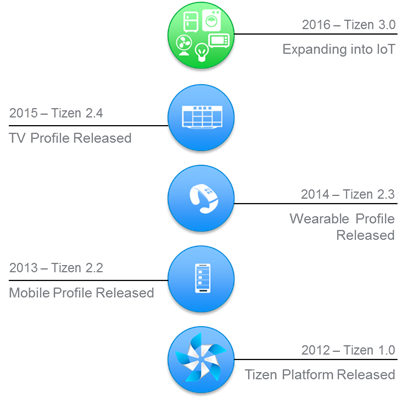
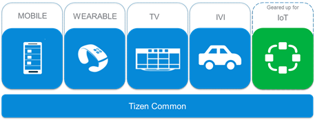

# Tizen 3.0

In the last 4 years Tizen has expanded its horizon from mobile devices, smart watch, to TV. Tizen currently runs in many commercially available devices. But the true potential of Tizen lies ahead and will be realized with support for the 'Internet of Things (IoT)', which connects everything.

Tizen supports multiple device profiles, each optimized for the device category taking care of diverse requirements for display, connectivity, user-interface, sensors, health, security, memory and performance requirements. All profiles are built on top of a common, shared infrastructure called Tizen Common providing the best optimized components. And even better, new profiles can be created and extended with ease, allowing new class of convergence devices to be added.

## Tizen 3.0's New Features for Enhancing Performance

Now, Tizen 3.0 adopts various new features such as high performance graphics, latest web technology, intensified security, and multi-user supports.

- **Vulkan - New Generation Graphics API**: Vulkan, Khronos' new graphics API, provides one unified API framework for desktop, mobile, console, and embedded unlike its predecessor OpenGL which had different versions for embedded and desktop (OpenGL ES and OpenGL). Vulkan minimizes driver overhead and provides multi-core friendly architecture enabling us to take advantage of multi core CPU's. Vulkan also enables reduced load on CPUs through the use of batching, leaving the CPU free to do additional computation or rendering.
- **Wayland - Lighter and better display server**: To improve performance of Tizen we have moved to a better and lighter display server "Wayland", which replaces the old X Windowing system. Compared to X, Wayland's simplified architecture enables it to have better performance, better memory usage and scalability. It is optimal solution for IoT devices with small display.
- **UHD support, Optimized Native Graphics**: Tizen 3.0 has also improved native graphics performance greatly. Tizen 3.0 supports UHD display format and the best part is it runs 30% faster compared to Tizen 2.4.
- **Crosswalk**: Tizen now supports Crosswalk, an open-source based web runtime built with the latest releases of Chromium and Blink. It is designed to support multi-platform so developers can code once and reuse on other platforms. By using the Crosswalk Project, application developers can:
- Use all the features available in modern web browsers: HTML5, CSS3, JavaScript.
- Access the latest recommended and emerging web standards.
- Use experimental APIs not available in mainstream web browsers.
- **Latest Linux LTS (Long Term Support) Kernel **ensures stability, performance and enabling us to use the latest kernel features. Also it enables Tizen to be more secure and up to date with latest kernel features.
- **64-bit support**: In order to extend the Tizen HW ecosystem to cover powerful CPU cores, Tizen 3.0 supports 64 bit CPUs including both Intel and ARM architectures. Utilizing high performance with more address space available in 64 bit CPUs, Tizen 3.0 will help developing high performance apps such as video editing and games.
- **Multi-user support**: We understand that devices such as Smart TVs/Tablets/Cars are shared by all family members and each of us want to keep it personalized to our own preferences and needs. To accommodate such needs, Tizen 3.0 supports multiple users via logins and multiple sessions. Using Tizen 3.0, each user of a device can control his or her own services, private contents and favorite settings independently from other users.
- **Simple and Flexible Security**: Security has been one of Tizen's major strengths. Strong security, however, has sometimes caused difficulties in managing security policies. To solve these difficulties, Tizen 3.0 introduces a new security model. By grouping same privileged system resources, the complexity of policy management at the kernel level is greatly reduced. For user space access control, we bring in a policy checker called Cynara that checks the application has the privilege to use privileged APIs. This provides a way to implement flexible, fast and safe policy-checking service for granting applications any necessary access to system resources, while it allows access control as API level granularity. Tizen 3.0 also introduces a new anti-virus framework and privacy guard. The privacy guard reports statics on how applications are using each resource such as GPS, Connectivity, and users can control the configuration of the same.
- **User Interface**: Tizen 3.0 introduces a host of changes to the User Interface module. Tizen 3.0 now has enhanced voice framework support. We now have speech-to-text support for around 11 languages and text-to-speech support for around 28 languages. Tizen 3.0 now also supports Voice Control via S-Voice.
- **Multimedia**: Tizen 3.0 starts to support face recognition and image recognition. Using the new simplified face recognition APIs, we can detect facial expression of a user or recognize faces on images. These newly added multimedia features will enable the developers to develop rich applications with seamless user interaction.

 

## IoT Capability of Tizen 3.0

The most important one that enables Tizen to move to the next level is IoT and convergence capabilities:

- **Device Convergence**: With the increase of devices being connected together, users are expecting more synergy among those devices. Tizen 3.0 provides device-to-device convergence framework for easy data sharing and remote application control directly between devices. Using this framework, you can handle events or data on the remote device as if they are local. For example, imagine setting up your morning alarm and that event being shared by all your devices so that your microwave oven starts cooking, TV automatically displays the news brief. Imagine also that without any effort the contact list on the phone is shared and synchronized among your devices. Device Convergence in Tizen opens up a host of capability that developers can use to create a path breaking user experience.
- **IoTivity for Connectivity**: In an IoT world, where everything is connected, it's important that a software platform supports seamless connectivity among all these devices. For seamless connectivity, Tizen is closely co-operating with Open Connected Foundation (OCF), which is defining a global standard for IoT connectivity. It is getting great support from industries including Cisco, GE, Mediatek, Intel and Samsung. OCF's standard is being implemented as an open source, which is called Iotivity. Its first version is ready to be released, and all the profiles in Tizen 3.0 will include Iotivity by default. It means all Tizen devices will be Iotivity-ready.

 

For detail information, see [Tizen 3.0 public M3 release note](../../release-notes/tizen-3-0-m3.md).
