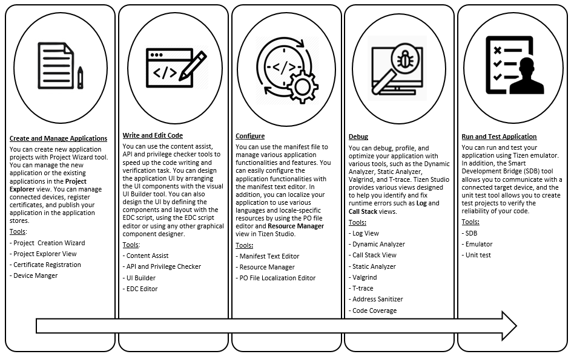

# Native Tools

This page explains about various native application development tools supported in Tizen Studio. With Tizen Studio IDE, the native app development is simplified, as it supports app development using languages such as C and C++.
In addition, Tizen Studio provides enhanced tools for building the UI, debugging, and for compiling and building the native app code.

Tizen Studio and its native application tools enable you to:
- Maximize the performance of a device to achieve higher throughput for time-sensitive apps, and run computationally intensive applications such as simulations and games.
- Provide access to platform libraries to manage native activities and access physical device components such as sensors, touch input panels, and Wi-Fi.
- Provide enhanced debugging, compilation, and integrated build tools. 

The native application development phases and the tools used in each phase are as follows:
- [Create and manage application](managing-projects.md)
- [Write and Edit Code](coding.md) 
- [Configure](configuring.md) 
- [Debug](debugging.md) 
- [Run and Test Your Application](running-testing.md) 

 

For advanced users, see [Command Line Interface (CLI)](../common-tools/command-line-interface.md).

For a list of keyboard shortcuts related to the Tizen Studio and its tools, see [Keyboard Shortcuts](../common-tools/keyboard-shortcuts.md).

## Related Information
- Dependencies
  - Tizen Studio 1.0 and Higher
