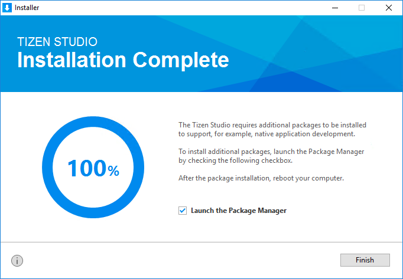

# Install Tizen Studio on Ubuntu

This page guides you with downloading and installing Tizen Studio on your development hardware. 

To have the optimal installation experience, follow these steps chronologically:

- System prerequisites
  - Hardware requirements
  - Software requirements
- Setup Open JDK in Ubuntu
- Install dependencies
- Launch installer
- Verify installation

### System Prerequisites

Ensure that the following system prerequisites are met:

#### Hardware Requirements

<table>
  <tr>
      <td>CPU</td>
    <td>Dual Core, 2Ghz or faster</td>
  </tr>
  <tr>
    <td>Architecture</td>
    <td>x32 or x64 </td>
  </tr>
  <tr>
    <td>Memory</td>
    <td>3GB or more </td>
  </tr>
  <tr>
    <td>Disk Space</td>
    <td>6 GB or more </td>
  </tr>
</table> 

#### Software Requirements

<table>
  <tr>
    <th colspan="2" align="left">Ubuntu</th>
  </tr>
  <tr>
    <td>Version</td>
    <td>16.04/ 14.04/ 18.04</td>
  </tr>
  <tr>
    <td>Bit</td>
    <td>32 or 64 bit</td>
  </tr>
</table>

<table>
  <tr>
    <th>Software</th>
    <th>Download Link </th>
  </tr>
  <tr>
    <td>Open JDK</td>
    <td>
    <a href="https://download.java.net/java/GA/jdk10/10/binaries/openjdk-10_linux-x64_bin.tar.gz" target="_blank"> Click to Download</a>
    </td>
  </tr>
  <tr>
    <td>OpenJavaFX</td>
    <td><a href="http://gluonhq.com/download/javafx-11-0-2-sdk-linux/" target="_blank">Click to Download </a></td>
  </tr>
  <tr>
    <td>Tizen Studio setup file</td>
    <td><a href=https://developer.tizen.org/development/tizen-studio/download# target="_blank">Click to Download</a></td>
  </tr>
</table>

> **Note**
>
> - Download the relevant version based on the target device operating system, for example, **openjdk-10_linux-x64_bin.tar.gz**. 
> - Ensure that you download the JavaFX <OS> SDK product only, for example: JavaFX Linux SDK.

**Disclaimer:** The third party download links are subjected to change. Search and download the appropriate software.

## Set Up Open JDK

To set up Open JDK, follow these steps: 

1. Extract the downloaded **openjdk-10_linux-x64_bin.tar.gz** and  **javafx-11-0-2-sdk-linux.zip** files at your preferred location.
   - Locate the **jdk-10** and the **javafx-sdk-11.0.2** directories.
     > **Note**
     >
     >The **jdk-10**, **javafx-sdk-11.0.2** directories are created as a result of extraction. 
   
2. Copy all the files except the **src.zip** file from the **lib** sub directory located in the **javafx-sdk-11.0.2** directory.
3. Paste all the copied files in the **lib** folder located in the **jdk-10** directory. 
   >Note:
   >
   >- In this installation guide, setting up OpenJDK is covered. However, Oracle JDK versions until version 10 are also supported.
   >- For Oracle JDK 10 installation steps, see the [Oracle official site](https://docs.oracle.com/javase/10/install/installation-jdk-and-jre-linux-platforms.htm#JSJIG-GUID-79FBE4A9-4254-461E-8EA7-A02D7979A161). 
   >- If you have installed Oracle JDK 10 or below already, you can skip **Setting up OpenJDK**. 

### Set Up Open JDK Path 

To set up the JDK path, follow these steps:  

1.	Open the terminal.
2.	Type the following command in the terminal to set JAVA_HOME as the OpenJDK directory path, for example:
	- `JAVA_HOME=/home/<username>/Desktop/openJDK/jdk-10.0.2/`.
3.	Type the following commands in the terminal one after the other to complete the process:
	- ` sudo apt update-alternatives --install /usr/bin/java java ${JAVA_HOME%*/}/bin/java 20000`
	- ` sudo apt update-alternatives --install /usr/bin/javac javac ${JAVA_HOME%*/}/bin/javac 20000`
4.	Type the following command to get a list of JDK versions installed:
	- ` sudo apt update-alternatives --config java`
	    > **Note**
      >
      > If there are multiple versions of JDK installed, enter the selection number to choose your desired JDK version.

5. To configure the default Java compiler, type the following command:
	
   - ` sudo apt update-alternatives --config javac`
	
	   > **Note**
     >
     >**javac** is used for compilation. For more information on the differences between java and javac, see the [Oracle documentation](https://docs.oracle.com).
	
6.	Type the `java –version` command to verify whether the OpenJDK version 10 is installed.
	
## Install Dependencies

The installer package consists of basic and immediate libraries. However, the Tizen Studio application requires additional libraries in order to work flawlessly. 

To install the dependencies, open the terminal and execute the following commands: 

```sudo apt install expect
 sudo apt install gtk2-engines-pixbuf
 sudo apt install libgnome2-0
 sudo apt install qemu-user-static
 sudo apt install libwebkitgtk-1.0-0
 sudo apt install libwebkitgtk-1.0-0 cpio rpm2cpio
 sudo apt install gettext
 sudo apt install gksudo
 sudo apt install module-init-tools
 sudo apt install libudev-dev
 sudo apt install libsdl1.2debian
 sudo apt install bridge-utils
 sudo apt install openvpn
 ```

 
### Install Emulator Dependencies

The Emulator also requires a few additional libraries to work smoothly. To install these dependencies, open the terminal and enter the following command:

  ` sudo apt install acl bridge-utils openvpn libfontconfig1 libglib2.0-0 libjpeg-turbo8 libpixman-1-0 libpng12-0 libsdl1.2debian libsm6 libv4l-0 libx11-xcb1 libxcb-icccm4 libxcb-image0 libxcb-randr0 libxcb-render-util0 libxcb-shape0 libxcb-xfixes0 libxi6`

## Launch Installer 

Navigate to the directory where you have saved the installer file and proceed with the further instructions. 

To launch the installer, follow these steps:

1. Open the terminal and execute the following commands:
	
	- `chmod +x web-ide_Tizen_Studio_x.x_ubuntu-64.bin`
	- `./web-ide_Tizen_Studio_x.x_ubuntu-64.bin` 
	>Note:
	>
	>**x.x** represents the latest version of Tizen Studio, for example: web-ide_Tizen_Studio_**3.3**_ubuntu-64.bin.
2. Accept the software license.
   
   > **Note**
   >
   >The license contains important legal notices for using Tizen Studio. Read it fully, and click **Accept** only if you agree with the license terms.

   

3. Click **Browse** and specify a new directory to set the SDK location and the SDK data location.

   
   
   >**Note** 
   > 
   >If the new directory is valid, it shows no errors.
4. Click **Install**.
5. Click **Finish** to close the installer.

   

   > **Note**
   >
   >If you want to install additional platforms and tools, launch Package Manager by selecting the Launch Package Manager **check box** and click **Finish**.
   > - Use Tizen Studio Package Manager, to install and update additional tools. 
   > - For more information on the Package Manager, see [Updating Tizen Studio](./update-sdk.md).

### Verify Installation
   
To verify whether the installation is successful or not, click **Tizen Studio icon**. The Tizen Studio startup window must appear.
