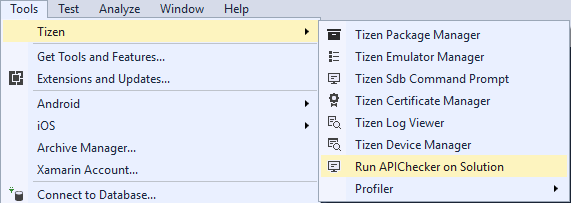
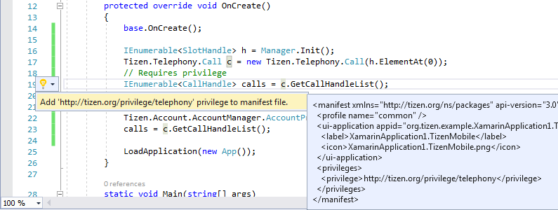

# API and Privilege Checker

Tizen provides an API and privilege checker tool, Tizen API Checker, which enables you to detect potential issues with privileges and APIs in your Tizen .NET application. This section explains how to:
- Run Tizen API Checker
- Quick-fix Tizen API Checker findings

Tizen API Checker allows you to detect the following issues at compile time and fix them using the Quick Actions functionality of Visual Studio:

- **Undefined privileges**

  If an application uses a method, which requires a privilege that is not defined in the application manifest file, an error message appears.

  For example, the `GetCallHandleList()` method of the [Tizen.Telephony.Call](https://developer.tizen.org/dev-guide/csapi/api/Tizen.Telephony.Call.html) class requires the `http://tizen.org/privilege/telephony` privilege. If you use this method in your application without defining the privilege in the manifest file, an error appears when you try to run the application.

- **Unused privileges**

  If an application contains privileges, which are not used by any APIs in the application, a warning message appears.

## Run Tizen API Checker

To run Tizen API Checker in your application, follow these steps:

1.  In the **Solution Explorer** view, select the project you want to analyze.
2.  In the Visual Studio menu, select **Tools &gt; Tizen &gt; Run APIChecker on Solution**.

    

When you run Tizen API Checker, the project is automatically built and Tizen API Checker verification is done during the build process.
When the verification is completed, the detected issues are listed in the **Error List** view. The view contains a detailed description of an issue, the file name and the line number in which the issue occurred. \
Undefined privileges are reported as errors, while unused privileges are reported as warnings.

 

## Quick-fix Tizen API Checker Findings

Undefined privileges are reported as errors. To fix the undefined privilege errors, follow these steps:

1.  In the **Error List** view, click the missing privilege error.

    The Quick Actions functionality in Visual Studio displays a light bulb on the left margin, next to the code line with the error.

2.  To reslove the error automatically, click the light bulb , and select the applicable item from the drop-down list.

    You can see the newly-added privilege in the `tizen-manifest.xml` file. The missing privilege error is automatically removed from the **Error List** view. 

    

Unused privileges are reported as warnings. You can execute the application successfully with warnings. 
To remove the warnings, you can remove the unused privileges from the`tizen-manifest.xml` file. 