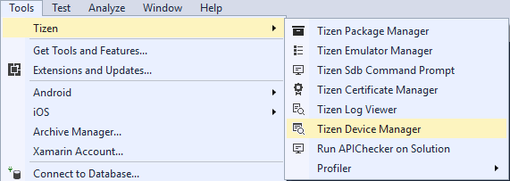
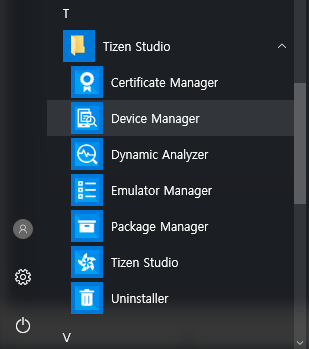
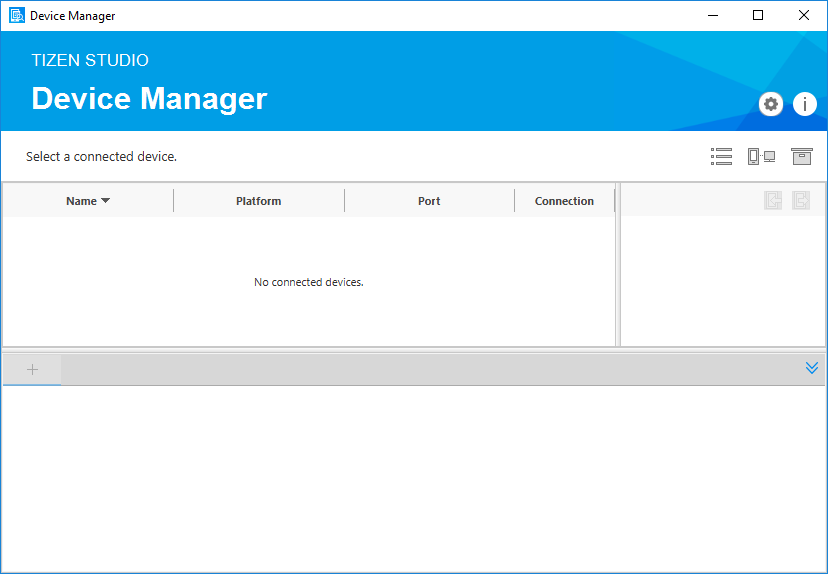
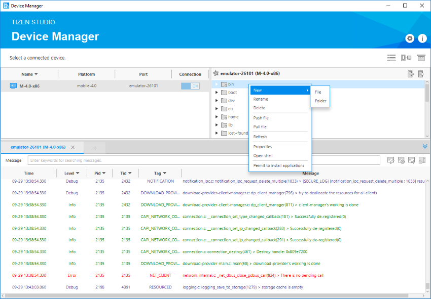
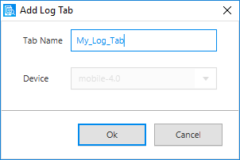
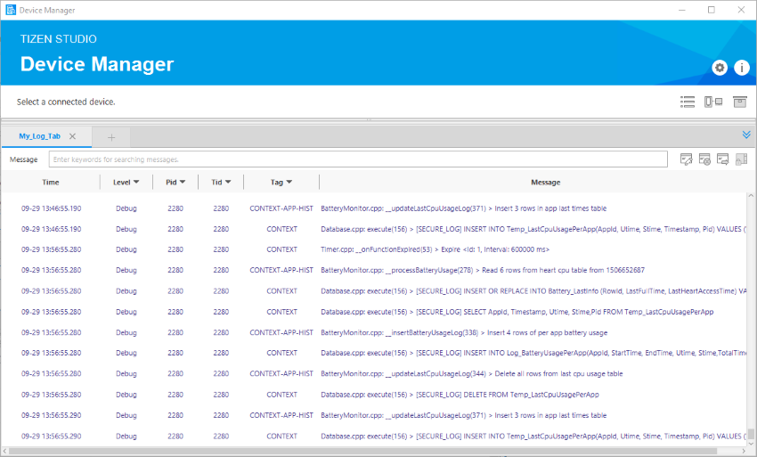
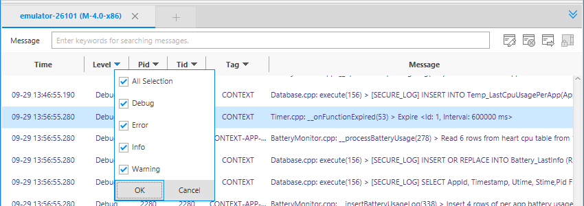
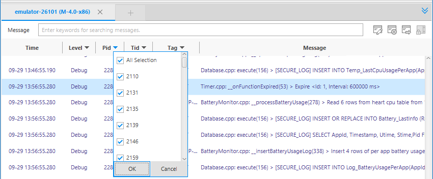
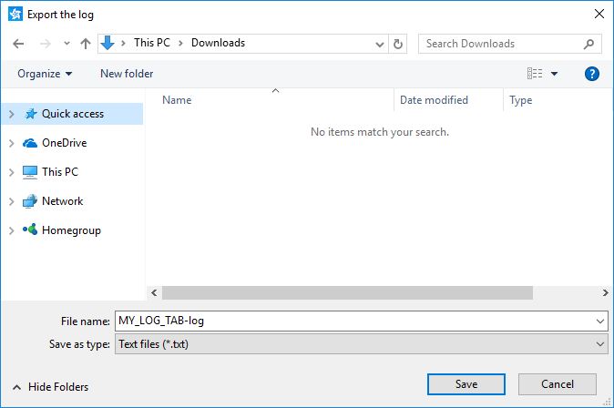

# Device Manager

Device Managers help you to manage the external devices connected to your computer. A device can be either a virtual device, such as an emulator or a physical device that is connected through a USB cable or a wireless connection. \
Tizen provides Tizen Device Manager, which is a standalone tool that helps you to:
- Manage connected devices or emulators
- Install applications
- Permit devices to install applications
- Push or pull files from the host computer to devices
- View device log details
- Configure Device Manager

This section explains about Tizen Device Manager and how to:
- [Launch Tizen Device Manager](#launch-tizen-device-manager)
- [Manage devices and device logs](#manage-devices-and-device-logs)

## Launch Tizen Device Manager

You can launch Tizen Device Manager in one of the following ways:

-   In the Visual Studio menu, select **Tools &gt; Tizen &gt; Tizen Device Manager**.

    

-   In the Windows&reg; **Start** menu, select **Device Manager**.

    

The **Tizen Device Manager** window appears.

## Manage Devices and Device Logs

Tizen Device Manager allows you to manage the devices and emulators connected to your system. 

In the **Tizen Device Manager** window, you can see the connection explorer view highlighted in red colour and the log view highlighted in green colour.



### Connection Explorer View

The connection explorer view shows the devices and emulators connected to the system. A list of connected devices is displayed in the tree view when you connect a device or launch Tizen Emulator Manager. You can use Tizen Device manager for any of the following purposes:

- See a list of connected devices and connect devices for running and debugging the application.
- Perform file operations such as push and pull on connected devices.
- Send or receive files between the **Solution Explorer** and **Connection Explorer** views by dragging and dropping. In the file explorer view (highlighted in red colour), you can perform any of the following actions:
    - See the folder and the file list of the connected device, and the file information such as date or size.
    - Create, delete, and rename files.
    - Upload and download files.
- Explore the file system on the connected devices.
- Launch Emulator Manager to handle multiple emulator instances.
- Launch Remote Device Manager to verify remote devices.
- Launch Package Manager to verify packages.



<a name="logview"></a>
### Log view

The Log View helps you to debug your application. It captures all the events logged by the platform and your application in the same order as they are logged. The Log View shows the logs through the Tizen logging system.

To create log messages, include the Tizen library in your project and call the functions of the [Tizen.Log](https://developer.tizen.org/dev-guide/csapi/api/Tizen.Log.html) class:

```csharp
using System;
using Tizen;

namespace XamarinApplication1.Tizen
{
    class Program : global::Xamarin.Forms.Platform.Tizen.FormsApplication
    {
        protected override void OnCreate()
        {
            /// Using Tizen.Log directly
            global::Tizen.Log.Debug("TEST", "Test Debug Message!");
            global::Tizen.Log.Error("TEST", "Test Error Message!");
            global::Tizen.Log.Fatal("TEST", "Test Fatal Message!");
            global::Tizen.Log.Info("TEST", "Test Info Message!");
            global::Tizen.Log.Verbose("TEST", "Test Verbose Message!");
            global::Tizen.Log.Warn("TEST", "Test Warn Message!");

            base.OnCreate();
            LoadApplication(new App());
        }

        static void Main(string[] args)
        {
            var app = new Program();
            global::Xamarin.Forms.Platform.Tizen.Forms.Init(app);
            app.Run(args);
        }
    }
}
```

The Log View displays a log table consisting of the following fields as shown in the highlighted section of **Figure: Added log tab**:

- Time: The time when an event is logged.
- Level: The level indicates the priority of the log message. Fatal is of the highest priority and Verbose is of the lowest.
- Pid: The process ID of the event.
- Tid: The Thread ID of the event.
- Tag: The log message source for identification.
- Msg: The log message in detail.


#### Add and Remove Log Tabs

To add a log tab, follow these steps:

1.  To add a new tab, click **Add +** next to the existing tabs.

    

2.  In the **Add Log Tab** window that appears, enter the **Tab Name** and select a device from the **Device** drop-down list, and click **OK**.

    
	
	The added log tab appears.

    **Figure: Added log tab**

    

To remove a log tab, follow these steps:

1.  To remove an existing tab, click **Close X** next to the tab name.

#### Filter Logs

In the log table, you have the following options and functions:

-   Log level filtering 

    To filter the log messages, select the messages types from the **Level** drop-down list and click **OK**.

    

-   Keyword filtering 

    To filter the log messages using keywords, use the following keywords, PID, Tag, and Message.
	You can either select the required values from the **Pid** and **Tag** drop-down lists and click **OK** or you can enter a keyword in the **Message** field at the top of the **Log View** window. You must separate the keywords with a space.
    
    

-   Scroll lock

    The log table shows all the latest logs by default. When you run the application, the content in the log table scrolls as new logs are added. To check a specific log when the logs are generated, you can stop scrolling. To stop scrolling, click **Scroll Lock** button .

-   Clearing the table

    To remove all the log messages from the log tab, click **Clear logs** .

-   Exporting logs to a file

    To export the current log messages and save them as a log file, click **Export logs** . By default, the file is saved in the .txt format. 

    

